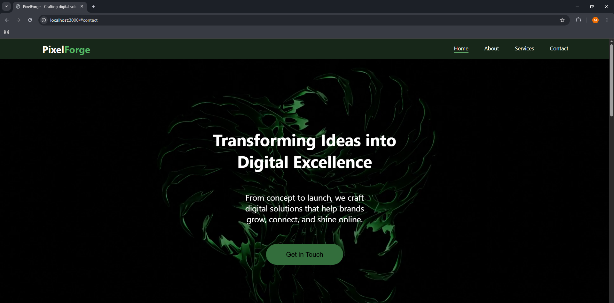
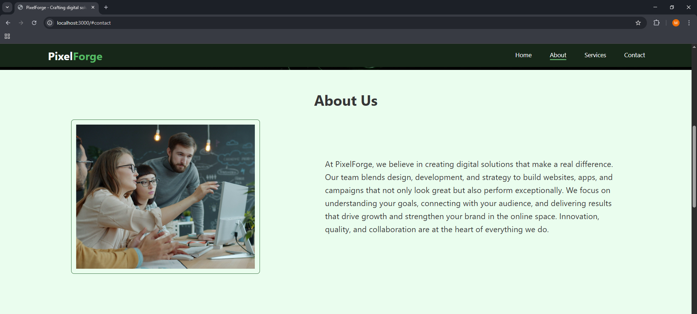
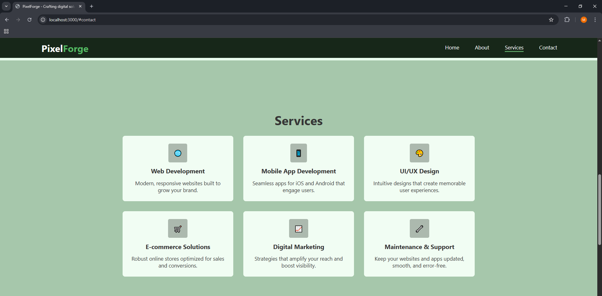
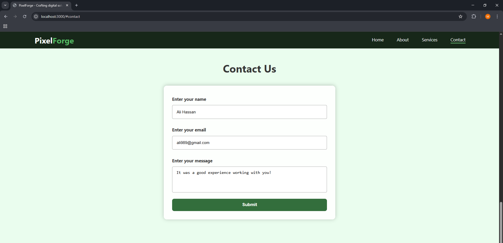
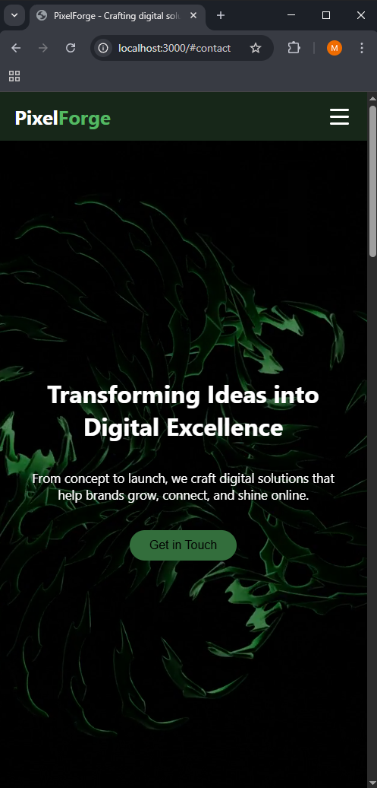
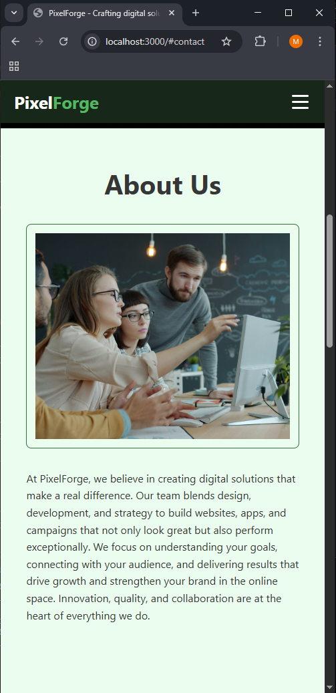
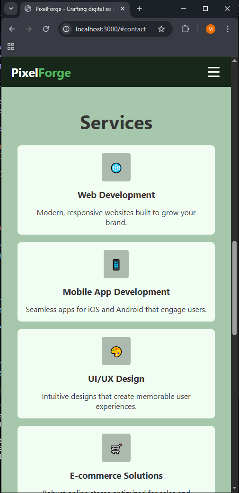
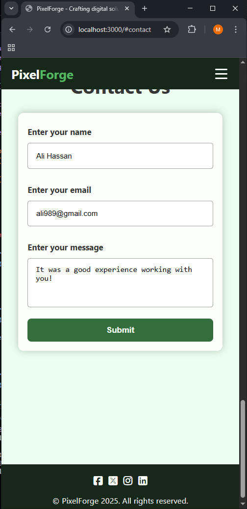
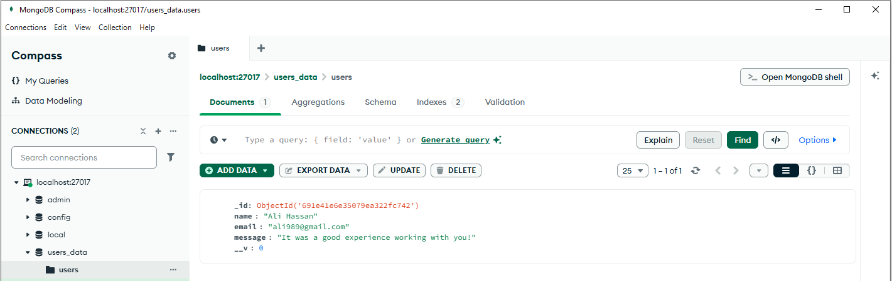

# 🌐Creative Web Demo - Full-Stack Task 4  

---

## Enhanced Landing Page With Backend Integration  

## 📌 Project Overview  
This task is part of my ongoing **Full-Stack Internship at CoreTech Innovations**.  
The goal was to improve the landing page created in **Task 3** by adding new front-end interactions, backend functionality, and database connectivity.  
This upgrade focuses on making the page more interactive, responsive, and fully connected to a working backend system that processes and stores form submissions.  

---

## 🎯 Purpose  
The purpose of this task was to continue practicing full-stack development by enhancing an existing project.  
This includes improving UI behavior, handling form data properly, creating backend routes, and saving user information in a database.  
The task helps strengthen the understanding of how the front-end, backend, and database work together in a simple full-stack workflow.  

---  

## 🚀 Features Added in Task 4
Below is an overview of the improvements and new functionality introduced in this task.  

### ✔ 1. Advanced Navigation Bar
- Sticky/fixed navbar  
- Active section highlighting while scrolling  
- Smooth scrolling to each section  
- Mobile hamburger menu with open/close animation  

---  

### ✔ 2. Hero Section Improvements  
- Full-screen background video  
- Text animations and smooth button hover effects  
- Clean and modern center-aligned hero content  

---

### ✔ 3. Services Section  
- Responsive grid layout  
- Service cards with hover animations  
- Icons for each service  
- Fully responsive on all screen sizes  

---  

### ✔ 4. Contact Form + Backend (Node.js + MongoDB)  
- Form fields: **Name, Email, Message**  
- Client-side validation (JavaScript)  
- Form data stored in **MongoDB database**  
- Shows:  
  - **Success page** (success.html) if stored correctly  
  - **Fail page** (fail.html) if an error occurs  

**Schema includes:**
- Required fields  
- Unique email  
- Message length 10–50 characters  

---  

### ✔ 5. Footer Section  
- Social media icons  
- Hover effects  
- Copyright text  

---

### ✔ 6. Responsiveness  
- Layout adjusts for **mobile**, **tablet**, and **large screens**  
- Hamburger menu for small screens  
- All sections optimized for readability  

---  

### ✔ 7. Backend (Node + Express + MongoDB)  
The backend handles:  
- Static file serving  
- URL encoded form handling  
- Database connection  
- POST `/submit` route for storing messages  

Files:  
- `server.js` (main backend file)  
- `success.html` and `fail.html` for responses  

---

## 📸 Screenshots  

  

  

  

  

  

  

  

  

  

  
